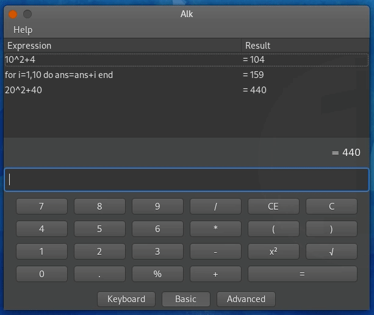

<div align="center">

</div>

---

<div align="center">

</div>

## Summary <!-- omit in toc -->

- [Build](#build)
  - [Windows or Mac](#windows-or-mac)
  - [Linux](#linux)
    - [Fedora](#fedora)
    - [Ubuntu](#ubuntu)

## Build
### Windows or Mac
I didn't tested the building on Windows or Mac myself, but it is possible since wxWidgets and Lua C API are both multiplatform

### Linux
The prerequisites are wxWidget and Lua C API. It's that simple and 
can be easily installed with your distro package manager. 

#### Fedora

Prerequisites:
```
dnf install wxGTK3 wxGTK3-devel lua-devel
```

Building:
```
git clone https://github.com/GustavoAle/alk
cd alk
make
```
Run:
```
./alk.elf
```

#### Ubuntu
Prerequisites:
```
apt install build-essential libwxgtk3.0-gtk3-dev liblua5.1-dev
```

Building:
```
git clone https://github.com/GustavoAle/alk
cd alk
export ALKTARGET=lua51
make
```
Run:
```
./alk.elf
```

<!--

<div align="center">


1.0

Special thanks to Al-Khwarizmi, the ancient Greeks and all those who founded 
the pillars of mathematics.

</div>

-->

